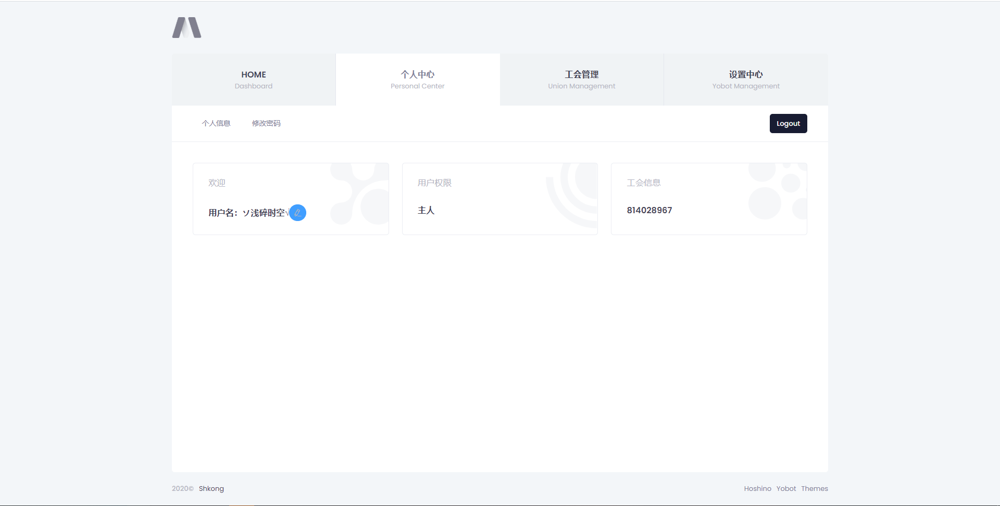
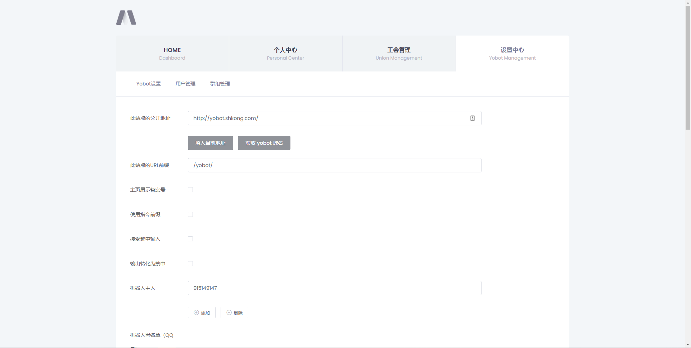
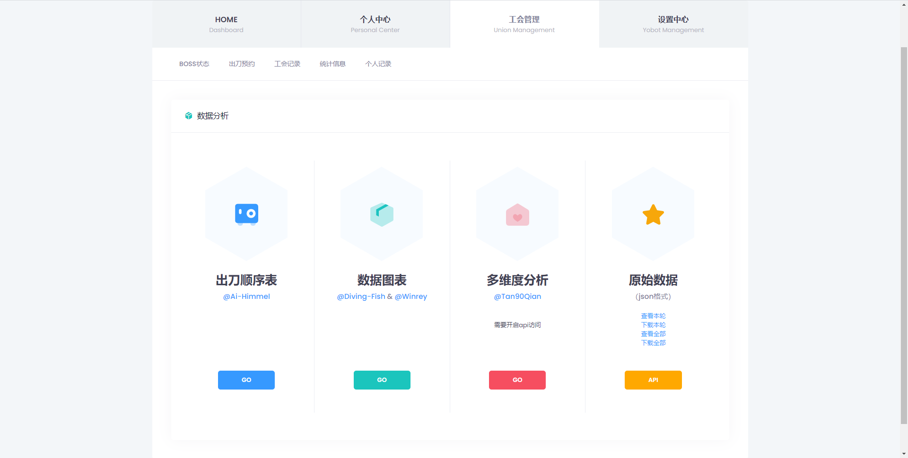

# YoWhite
A template for Yobot

本项目仅为模板，请配合 [Yobot](https://github.com/pcrbot/yobot) 使用

This project is only a template, please use it with [Yobot](https://github.com/pcrbot/yobot)

## 本项目的根目录位于\yobot\src\client\ 请进入此文件夹后再根据本项目文件地址进行替换！
## The root directory of this project is located at \yobot\src\client\ Please enter this folder and then replace it according to the file address of this project!

## 如何使用 How to use

- 插件版或源码版：

  直接覆盖，**修改template/base.html和login.html的第6行{{botname}}为你机器人的名字**，重启Yobot 

- 便携版：

  更换插件版或源码版，再进行上述操作

  或自行替换文件重新打包

## 已知问题 Known issues

- ~~部分页面无法获取到{{ group_id }}导致无法通过导航栏进入工会战页面~~

- ~~在没有加入任何工会时无法访问~~

- ~~手机访问可能存在无法点出侧边栏~~

## 代码贡献 Code contribution

感谢以下大佬在本项目中提供的支援和帮助

Thanks to the following users for their support and help in this project

[@A-kirami](https://github.com/A-kirami)

[@kaiseixd](https://github.com/kaiseixd)

[@xuexue49](https://github.com/xuexue49)

## 联系我们 Contact us

Yobot后台美化组(Q群)：1143518690

Yobot background beautification group (QQ group):1143518690

## 相关项目 Related Projects

- [YoCool](https://github.com/A-kirami/YoCool/)

## 展示 Display

首页

用户页

管理页

工会战

数据统计

